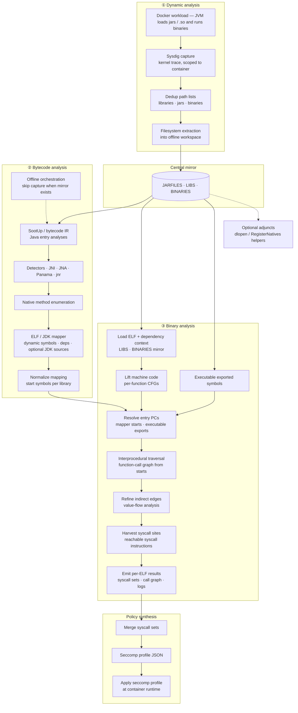

```mermaid
flowchart TB
  subgraph dyn["① Dynamic analysis"]
    direction TB
    RW["Docker workload — JVM loads jars / .so and runs binaries"]
    SD["Sysdig capture<br/>kernel trace, scoped to container"]
    PL["Dedup path lists<br/>libraries · jars · binaries"]
    EX["Filesystem extraction<br/>into offline workspace"]
    RW --> SD --> PL --> EX
  end

  subgraph mirror["Central mirror"]
    direction TB
    M[(JARFILES · LIBS · BINARIES)]
  end

  subgraph bc["② Bytecode analysis"]
    direction TB
    RA["Offline orchestration<br/>skip capture when mirror exists"]
    BC["SootUp / bytecode IR<br/>Java entry analyses"]
    DET["Detectors · JNI · JNA · Panama · jnr"]
    NM["Native method enumeration"]
    MP["ELF / JDK mapper<br/>dynamic symbols · deps · optional JDK sources"]
    PR["Normalize mapping<br/>start symbols per library"]
    RA -.-> BC
    BC --> DET --> NM --> MP --> PR
  end

  subgraph bin["③ Binary analysis"]
    direction TB
    ELFIN["Load ELF + dependency context<br/>LIBS · BINARIES mirror"]
    CFG["Lift machine code<br/>per-function CFGs"]
    RESOLVE["Resolve entry PCs<br/>mapper starts · executable exports"]
    FCG["Interprocedural traversal<br/>function-call graph from starts"]
    VFA["Refine indirect edges<br/>value-flow analysis"]
    SYH["Harvest syscall sites<br/>reachable syscall instructions"]
    SC["Emit per-ELF results<br/>syscall sets · call graph · logs"]
    EXSYM["Executable exported symbols"]
    ELFIN --> CFG --> RESOLVE --> FCG --> VFA --> SYH --> SC
    EXSYM --> RESOLVE
  end

  subgraph pol["Policy synthesis"]
    direction TB
    GEN["Merge syscall sets"]
    PROF["Seccomp profile JSON"]
    OUT["Apply seccomp profile<br/>at container runtime"]
    GEN --> PROF --> OUT
  end

  EX --> M --> BC
  M --> ELFIN
  M --> EXSYM
  PR --> RESOLVE
  SC --> GEN

  OPA["Optional adjuncts<br/>dlopen / RegisterNatives helpers"]
  M -.-> OPA
```

