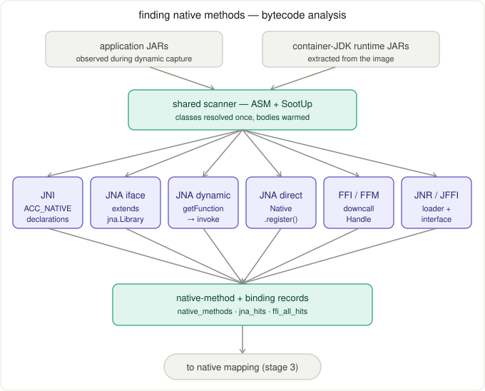
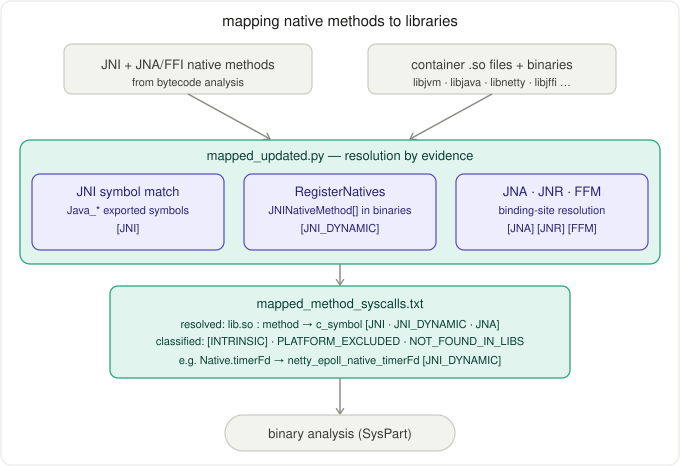

# EchoTrace

[](https://github.com/MadriSec/EchoTrace/actions/workflows/ci.yml)

**Static and dynamic analysis framework for generating container-specific seccomp allowlists for Java applications.**

EchoTrace analyzes how a Java container reaches native code and, from there, Linux system calls. It combines runtime observation of the container with static analysis of Java bytecode and native ELF binaries. The output is a JSON syscall allowlist that can be used as the basis for a Docker seccomp profile.

```
Dynamic Capture -> Bytecode Analysis -> Native Mapping
-> Syscall Reachability -> JSON Allowlist
```

---

## Table of Contents

- [Architecture Overview](#architecture-overview) — **[ARCHITECTURE.md](ARCHITECTURE.md)** (diagram only)
- [Dynamic Analysis (Sysdig / eBPF)](#dynamic-analysis-sysdig--ebpf)
- [Container Artifact Extraction](#container-artifact-extraction)
- [Finding Native Methods (Bytecode Analysis)](#finding-native-methods-bytecode-analysis)
  - [Detector Documentation](src/main/java/com/echotrace/app/bytecode_new/README.md)
- [Mapping Native Methods to Libraries](#mapping-native-methods-to-libraries)
- [Binary Analysis with SysPart (VFA)](#binary-analysis-with-syspart-vfa)
- [Seccomp Profile Generation](#seccomp-profile-generation)
- [End-to-End Pipeline](#end-to-end-pipeline)
- [Project Structure](#project-structure)
- [Quick Start](#quick-start)
- [Results](#evaluation-results-snapshot)
- [License](#license)

---

## Architecture Overview

EchoTrace has four stages:

1. **Dynamic capture:** observe the running container and identify the JARs, native libraries, and binaries it uses.
2. **Bytecode analysis:** scan application and container-JDK runtime JARs for Java methods and APIs that can enter native code.
3. **Native mapping:** map Java native methods and binding sites to concrete native symbols in container-extracted `.so` files.
4. **Syscall reachability:** run SysPart from the recovered native start functions and merge reachable syscalls into a JSON allowlist.

The key design choice is that EchoTrace analyzes the container's own artifacts rather than the host environment. Java native methods and their implementations differ across JDK versions and distributions, so using the host JDK can produce incorrect mappings.

| Stage | Tool | Input | Output |
|-------|------|-------|--------|
| 1. Dynamic capture | Sysdig (eBPF) | Running container | Lists of loaded libraries, JARs, executables |
| 2. Extraction | `docker cp` | Container filesystem | `LIBS_<IMG_NAME>/`, `JARFILES_<IMG_NAME>/`, `BINARIES_<IMG_NAME>/`, `RUNTIME_<IMG_NAME>/` directories |
| 3. Bytecode analysis | ASM + SootUp | Application and runtime JARs | Native method and native binding records |
| 4. Native mapping | Mapper + ELF tools | Native records + `.so` files | Java method -> native symbol -> library |
| 5. Binary analysis | SysPart VFA | `.so` files + mapper starts; executables + entry/import starts | Syscall summaries per ELF |
| 6. Profile generation | Seccomp profile generator | Aggregated syscalls | JSON allowlist |

---

## Dynamic Analysis (Sysdig / eBPF)

### What We Monitor


EchoTrace uses [Sysdig](https://github.com/draios/sysdig) with the modern eBPF backend (`--modern-bpf`) to observe container activity without modifying the application. The unified capture is a clean-start run:

```
stop container -> start Sysdig -> wait for probes -> start container
```

This ordering captures JVM startup, where most JARs, runtime modules, and native libraries are loaded.

The unified capture monitors:

```
open, openat, openat2  -> JAR files and native libraries opened by the JVM
mmap                   -> mapped artifacts, included for completeness
execve                 -> native binaries launched inside the container
```

Events are scoped to the target container using Docker metadata resolved through `docker inspect`:

```
container.name = <name> OR container.id = <container-id>
```

Using both fields avoids missing JVM startup events when name attribution is incomplete.

### Running a Capture

```bash
# Capture a container clean-start run (120s default)
./scripts/sysdig_unified.sh <container_name_or_id> [duration_seconds]
```

**Outputs** (in `sysdig_outputs_<IMG_NAME>/`):

- `jni_libs_opened.txt` -- deduplicated `.so` file paths
- `jars_unique_<IMG_NAME>.txt` -- deduplicated `.jar` file paths
- `binaries_unique_<IMG_NAME>.txt` -- deduplicated executable paths
- `libs_by_pid.txt` -- PID/process/library attribution

`mmap` is monitored for completeness, but in the final evaluation captures the observed `.so` artifacts were discovered through `open`/`openat` events.

---

## Container Artifact Extraction

Once Sysdig identifies which files the container uses, EchoTrace extracts those paths from the container filesystem for offline analysis:

```
JARFILES_<image>/    # Application and dependency JARs
LIBS_<image>/        # Native shared libraries (.so files)
BINARIES_<image>/    # Executed native binaries
RUNTIME_<image>/     # Runtime JARs/modules from the container JDK
```

The runtime extraction is important: EchoTrace analyzes the JDK that actually runs inside the container, not the host JDK.

---

## Finding Native Methods (Bytecode Analysis)

### The Problem

Dynamic capture tells EchoTrace what files were loaded; bytecode analysis tells it which Java code can enter native code. Java applications may cross into native code through ordinary JNI declarations, dynamically registered JNI methods, JNA, JNR/JFFI, or FFI/FFM APIs.

### How We Find Them

Two input sources — application JARs and the container's own JDK runtime — are scanned once in a shared ASM/SootUp context, which dispatches to a dedicated detector per native-interface mechanism. Their hits merge into the native-method and binding records consumed by native mapping:

<p align="center">
  
</p>

EchoTrace analyzes:

```
Application JARs observed during dynamic capture
Runtime JARs/modules extracted from the container JDK
```

The scanners use ASM and SootUp. Each native interface type has a dedicated detector:

| Type | Detector | Detection strategy |
|------|----------|-------------------|
| JNI native declarations | `PrototypeFinal` | Scan for `ACC_NATIVE` methods |
| JNA Interface | `JnaIfaceDetector` | Find interfaces extending `com.sun.jna.Library` |
| JNA Dynamic | `JnaDynDetector` | Track `NativeLibrary.getInstance()` -> `getFunction()` -> `invoke()` |
| JNA Direct | `JnaDirectMapDetector` | Find `Native.register()` and enumerate native methods |
| FFI/FFM | `FfiDetector` | Track `SymbolLookup` -> `find()` -> `downcallHandle()` |
| JNR/JFFI | `JnrFfiDetector` | Find JNR/JFFI library-loader and interface patterns |

> For detailed documentation of each detector (Java patterns, output formats, limitations), see [`src/main/java/com/echotrace/app/bytecode_new/README.md`](src/main/java/com/echotrace/app/bytecode_new/README.md)

### Unified Detector

```bash
mvn -f pom.xml -q clean compile exec:java \
  -Dexec.mainClass=com.echotrace.app.bytecode_new.JNADetector \
  -Dexec.args="<JARFILES_dir> <outputs_dir> <RUNTIME_dir>"
```

Important outputs:

- `native_methods.txt` -- Java native method declarations
- `jna_hits.txt` -- merged JNA/JNR/FFI native binding hits
- `ffi_all_hits.txt` -- FFI/JNR-family hits
- `analyzed_jars.txt` -- application and runtime archives scanned by the detector

---


## Mapping Native Methods to Libraries

After bytecode analysis, EchoTrace maps Java native methods and binding sites to native functions in the `.so` files extracted from the same container.

### How Mapping Works

`mapped_updated.py` combines several sources of evidence — matching `Java_*` exports, recovering `RegisterNatives` tables from binaries, and resolving JNA/JNR/FFM binding sites — to tag each method with a library, native symbol, and resolution type:

<p align="center">
  
</p>

`mapped_updated.py` combines several sources of evidence.

**1. Standard JNI symbol matching**

EchoTrace scans container-extracted `.so` files for exported JNI symbols:

```text
Java_<package>_<class>_<method>
```

It also handles overloaded JNI names and common JNI mangling variants such as `_1`.

**2. RegisterNatives binary extraction**

Many native methods are not exported as `Java_*` symbols. They are registered at runtime through `RegisterNatives`. EchoTrace recovers these mappings directly from the container's native binaries, including libraries such as:

```text
libjvm.so
libjava.so
libnetty*.so
libjffi*.so
```

For example, a native table may contain:

```c
static JNINativeMethod methods[] = {
  { "start0", "()V", (void *)&JVM_StartThread }
};
```

EchoTrace recovers:

```text
java.lang.Thread.start0()V -> JVM_StartThread -> libjvm.so
```

This binary-level recovery is preferred over source-code assumptions. OpenJDK source scanning through `JVM_SRC` is only a fallback when binary extraction is unavailable.

**3. JNA, JNR/JFFI, and FFI mappings**

EchoTrace also resolves non-JNI native binding mechanisms:

- JNA direct mappings map Java native method names to C symbols in the registered library.
- JNA interface mappings treat interface methods as native symbols.
- JNA dynamic mappings recover library and function names from dynamic lookup patterns.
- JNR/JFFI and FFI/FFM mappings identify bridge-based native calls and downcall targets.

**Output:** `mapped_method_syscalls.txt`

```text
libjvm.so:java.lang.Thread.start0 -> JVM_StartThread [JVM_REGISTERED]
libjava.so:java.io.FileInputStream.readBytes -> Java_java_io_FileInputStream_readBytes [JNI]
libc.so.6:org.example.Native.getpid -> getpid [JNA]
```

Each line gives:

```text
library:java.method -> c_symbol [resolution_type]
```

### Post-Processing

- `scripts/filter.sh` -- removes `NOT_FOUND_IN_LIBS` entries (methods with no library match)
- `scripts/change_format.py` -- groups C symbols by library, producing per-library start-function files for SysPart

---

## Binary Analysis with SysPart (VFA)

### What SysPart Does

[SysPart](https://arxiv.org/abs/2309.05169) ([CCS ’23](https://doi.org/10.1145/3576915.3623207); [codebase](https://github.com/vidyalakshmir/SysPartCode/tree/optimizations)) is a research system for **binary-only** syscall surface reduction; at its core it builds **sound (conservative) control- and call-graph views** of x86-64 Linux ELF code and uses **value-flow analysis (VFA)** together with other static techniques to **refine the function-call graph (FCG)**—especially around **indirect calls** and **dynamically resolved targets**—before reasoning about which **syscall** sites are reachable.

EchoTrace plugs into SysPart's **static syscall computation** pipeline: we supply **ELF paths** (mirrored `.so` files and extracted executables) and **explicit start functions**. For shared libraries, these starts normally come from the Java-to-native mapper. If bytecode mapping is unavailable, EchoTrace can fall back to exported dynamic symbols. For binaries observed through `execve`, EchoTrace uses `_start` when available and otherwise falls back to imported dynamic functions. SysPart then answers: *starting from those addresses, which syscall instructions can this binary reach?*

### What SysPart Does Internally (per ELF)

When analysis runs (via **`compute_syscalls.sh`** under your **`SysPartCode/analysis/app`** checkout, as invoked by **`scripts/automate_syscall_analysis.sh`**), the workflow is roughly:

1. **Load & configure the binary.** The target ELF is loaded for analysis; **`USER_LIBRARY_PATH`** points SysPart at EchoTrace’s extracted **`LIBS_*`** tree so dependent shared objects resolve the same way as in the offline mirror.

2. **Lift machine code to analyzable CFGs.** Functions are disassembled/lifted into **control-flow graphs (CFGs)** over basic blocks—the usual prerequisite for sound whole-program reasoning on stripped or partially stripped ELFs.

3. **Resolve start addresses.** Each name in the start-function list is bound to an entry address (see **`startfuncs_with_addr.txt`** in the output bundle).

4. **Explore an interprocedural call graph.** Analysis walks **reachable functions** outward from those starts: **direct calls** give precise edges; **indirect calls**, PLT/GOT behavior, and similar patterns are handled with conservative models that SysPart **tightens using VFA** (and related heuristics described in the paper) so the **FCG** is not blindly “every possible target.”

5. **Collect syscall sites.** Along reachable paths SysPart identifies instructions that actually issue Linux syscalls—on x86-64 typically the **`syscall`** instruction once the syscall number is determined—and records those syscall numbers/names into **`syscalls.txt`**.

6. **Emit diagnostics.** **`callgraph.json`** captures the explored call structure; **`allfunctions.txt`** lists reachable symbols encountered during the walk; **`logfile.txt`** captures warnings (unresolved jumps, missing symbols, etc.).

This is **static** analysis: it does not require running the container during SysPart itself. Precision is bounded by reverse-engineering realities such as opaque indirect jumps, hand-written assembly, stripped symbols, and unusual loaders. EchoTrace keeps the analysis container-specific by analyzing the exact libraries and binaries extracted from the image.

### EchoTrace vs the Full SysPart Paper

The published SysPart system also targets **temporal** syscall filtering for servers (initialization vs serving phases), combines analysis passes built on **Egalito**, and may use **dynamic** observations where static resolution of **`dlopen` / `dlsym`** is incomplete. EchoTrace's integration focuses on the **same static backbone**--CFG/FCG construction with **VFA-informed** reachability--but drives it with **EchoTrace-derived start functions** and merges results into a **single Docker seccomp profile** over libraries *and* helper binaries. Treat the paper as the authoritative reference for algorithmic detail; treat this repo's scripts as the **wiring** from Java bytecode -> ELF mirrors -> **`syscalls.txt`** -> **`seccomp.json`**.

### How We Use It

EchoTrace runs SysPart **once per analyzed ELF**: **`scripts/automate_syscall_analysis.sh`** prepares start-function files, sets **`USER_LIBRARY_PATH`** to the extracted library tree, and invokes **`SysPartCode/analysis/app/src/scripts/compute_syscalls.sh`** with the binary path, output directory, and start list. In the normal Java path, start functions come from the native-method mapper; in fallback modes they come from library exports or executable starts/imports.

```bash
./scripts/automate_syscall_analysis.sh \
  --binary-dir LIBS_cassandra/ \
  --startfunc-dir outputs_cassandra/ \
  --output-dir syscalls_output_cassandra/ \
  --img-name cassandra
```

### SysPart Output (per library)

```
syscalls_output_cassandra/
  libjvm.so/
    allfunctions.txt          # All reachable functions
    callgraph.json            # Full call graph
    syscalls.txt              # Reachable syscall numbers/names
    startfuncs_with_addr.txt  # Start functions with addresses
    logfile.txt               # Analysis log
```

### Analysis Modes

`scripts/run_analysis.sh` supports three modes:

| Mode | Start Functions | Use Case |
|------|-----------------|----------|
| `FULL_BYTECODE` | C symbols from the native-method mapper | Standard: bytecode analysis -> mapper -> SysPart |
| `LIBRARY_SYMBOLS` | Exported dynamic symbols from `nm -D` | Library fallback when Java mapping is unavailable |
| `BINARY_ONLY` | `_start` when available; otherwise imported `UND` functions from `objdump -T` | Native binaries observed through `execve` |

### Handling Stripped Binaries

When symbol information is limited, EchoTrace uses the best start functions available for the artifact type. For libraries, the preferred source is still the Java-to-native mapping; exported dynamic symbols are a fallback mode. For executed binaries, EchoTrace uses `_start` if it can resolve it and otherwise falls back to imported dynamic functions. Optional debug-symbol extraction can improve names and coverage when separate debug packages are available.

### dlopen/dlsym Analysis

Some native targets are resolved through `dlopen()` and `dlsym()` rather than ordinary JNI naming. EchoTrace primarily accounts for these paths through bytecode-level JNA/JNR/JFFI/FFI detection and by analyzing the libraries observed during dynamic capture. The repository also contains helper code for inspecting explicit `dlopen`/`dlsym` behavior:

**Static helpers** (`SysPartCode/analysis/app/src/dlanalysis/static/`):
- Finds `dlopen()` and `dlsym()` call sites in binaries
- Recovers string arguments when they are compile-time constants

**Dynamic helpers** (`SysPartCode/analysis/app/src/dlanalysis/dynamic/`):
- Uses `LD_PRELOAD` function interposition to intercept `dlopen()`/`dlsym()` at runtime
- Captures actual library paths and symbol names

**JNI dynamic binding**:
- `scripts/extract_registernatives_binary.py` recovers `JNINativeMethod[]` registrations from container libraries when methods are registered through `RegisterNatives` instead of exported as `Java_*` symbols

---

## Seccomp Profile Generation

### From Syscalls to Seccomp

After all libraries and observed executables are analyzed by SysPart, EchoTrace aggregates their syscall lists and writes a Docker-compatible seccomp profile. In the normal pipeline this is done by `scripts/merge_all_syscalls.py`, which is invoked automatically from `scripts/automate_syscall_analysis.sh`:

```bash
python3 scripts/merge_all_syscalls.py cassandra
# writes syscalls_output_cassandra/cassandra.txt and syscalls_output_cassandra/cassandra.json
```

For a standalone syscall text file or directory, `scripts/generate_seccomp.py` can also be used directly:

```bash
python3 scripts/generate_seccomp.py \
  --input syscalls_output_cassandra/cassandra.txt \
  --output seccomp_cassandra.json
```

**Output format:**
```json
{
  "defaultAction": "SCMP_ACT_ERRNO",
  "architectures": ["SCMP_ARCH_X86_64", "SCMP_ARCH_X86", "SCMP_ARCH_X32"],
  "syscalls": [
    {
      "names": ["accept4", "bind", "clone", "close", "epoll_create1", "..."],
      "action": "SCMP_ACT_ALLOW"
    }
  ]
}
```

Everything not explicitly allowed is denied (`SCMP_ACT_ERRNO`). The generated profile is a restrictive, container-specific allowlist derived from observed artifacts and static reachability; it should be validated with the workload before deployment.

### Using the Profile

```bash
docker run --security-opt seccomp=syscalls_output_cassandra/cassandra.json cassandra:latest
```


---

## End-to-End Pipeline

The root entrypoint is `final_tool.sh`. It keeps the top-level workflow small and delegates the implementation to scripts under `scripts/`:

```text
final_tool.sh
  -> scripts/sysdig_unified.sh
  -> scripts/extract_runtime_and_jar_libs.sh
       -> scripts/extract_container_jdk.py
       -> scripts/extract_libs_jars.sh
  -> scripts/run_analysis.sh
       -> JNADetector / PrototypeFinal
       -> scripts/prepare_native_mapping.sh
            -> scripts/mapped_updated.py
            -> scripts/filter.sh
            -> scripts/change_format.py
       -> scripts/automate_syscall_analysis.sh
            -> SysPartCode/analysis/app/src/scripts/compute_syscalls.sh
            -> scripts/merge_all_syscalls.py
```

`final_tool.sh` is interactive: it lists running containers and asks for the target container ID/name. The per-image suffix `IMG_NAME` is derived from the Docker image name, and all generated artifacts are written to image-scoped directories such as `JARFILES_<IMG_NAME>/`, `LIBS_<IMG_NAME>/`, `RUNTIME_<IMG_NAME>/`, `outputs_<IMG_NAME>/`, `syscalls_output_<IMG_NAME>/`, and `syscalls_BIN_<IMG_NAME>/`.

---

## Project Structure

```text
final_tool.sh                  # interactive end-to-end entrypoint
build.sh                       # Maven build + dependency copy
scripts/                       # dynamic capture, extraction, mapping, SysPart orchestration
src/main/java/.../bytecode_new # Java bytecode/native-binding detectors
SysPartCode/                   # SysPart submodule
runc.txt                       # baseline runtime syscalls merged into generated profiles
```

The `SysPartCode/` submodule tracks the upstream [SysPartCode optimizations branch](https://github.com/vidyalakshmir/SysPartCode/tree/optimizations).

---


## Quick Start

### Prerequisites

EchoTrace is intended for a Linux x86-64 host that can run Docker containers and analyze x86-64 ELF binaries. Dynamic capture uses Sysdig with the modern eBPF backend, which requires Linux kernel 5.8 or newer. The current SysPart submodule has been tested upstream on Ubuntu 22.04; other recent Linux distributions may work, but package names can differ.

Host tools used by the pipeline:

- Docker CLI and daemon access for `docker ps`, `docker inspect`, `docker exec`, `docker cp`, `docker stop`, and `docker start`
- Sysdig with modern eBPF support for dynamic capture; the scripts run `sudo sysdig --modern-bpf`, which requires Linux kernel >= 5.8
- Java JDK 11+ with `java` and `javac` on `PATH`
- Maven 3.6+
- Python 3.8+
- Python package: `pyelftools`
- ELF/native utilities: `binutils` (`nm`, `objdump`, `readelf`), `file`, `ldd`, `unzip`, `make`, `g++`, `gdb`, `libreadline-dev`, `libunwind-dev`, and debug libc/libstdc++ packages for better SysPart results
- SysPart submodule checked out at `SysPartCode/` for binary analysis ([optimizations branch](https://github.com/vidyalakshmir/SysPartCode/tree/optimizations))

On Ubuntu 22.04 or another host with Linux kernel >= 5.8, a typical setup is:

```bash
sudo apt-get update
sudo apt-get install -y \
  docker.io sysdig openjdk-17-jdk maven python3 python3-pip \
  binutils file unzip make g++ gdb lsb-release libreadline-dev libunwind-dev \
  libc6-dbg libstdc++6-12-dbg

python3 -m pip install --user pyelftools
```

If your host has a different GCC runtime, replace `libstdc++6-12-dbg` with the matching `libstdc++6-<version>-dbg` package.

Clone with submodules, or initialize them after cloning:

```bash
git submodule update --init --recursive
```

Build SysPart once before running binary analysis:

```bash
cd SysPartCode
./build_upgraded_egalito.sh
cd ..
```

### Build

```bash
# Build the main analysis tool and copy Maven dependencies
./build.sh
```

### Run

```bash
# Start your target container
docker run -d --name my-app my-image:latest

# Run the full analysis. The script prompts for the container ID/name.
./final_tool.sh

# Result: syscalls_output_<IMG_NAME>/<IMG_NAME>.json
docker run --security-opt seccomp=syscalls_output_my-image_latest/my-image_latest.json my-image:latest
```

For a non-interactive rerun using already extracted artifacts:

```bash
IMG_NAME=my-image_latest SKIP_SYSDIG=1 ./scripts/run_analysis.sh
```

---

## Evaluation Results Snapshot

The following snapshot summarizes the JDK 8 container results from the current EchoTrace evaluation. The final syscall allowlist averages **153.8 syscalls** across these ten applications. Compared with the Docker default seccomp policy, which allows approximately **305 syscalls** out of a 360-syscall universe after denying 55, this is about a **49.6% reduction** in the allowed syscall surface.

### Native Method Resolution

| Application | Base OS | JDK | Total natives | EchoTrace resolved | EchoTrace not found |
|-------------|---------|-----|---------------|--------------------|---------------------|
| ZooKeeper 3.4.14 | Debian GNU/Linux 10 Buster | JDK 8 | 234 | 234 | 0 |
| Tomcat 7.0 | Debian GNU/Linux 10 Buster | JDK 8 | 614 | 614 | 4 |
| Cassandra 3.0.29 | Debian GNU/Linux 10 Buster | JDK 8 | 686 | 686 | 0 |
| Jetty 9.4.51 | Debian 10 Buster | JDK 8 | 225 | 225 | 0 |
| Storm 2.4.0 | Debian 11 Bullseye | JDK 8 | 1547 | 1494 | 0 |
| OrientDB 3.2.19 | Debian 10 Buster | JDK 8 | 519 | 519 | 0 |
| Elasticsearch 7.5.2 | Debian 10 Buster | JDK 8 | 368 | 368 | 0 |
| Solr 8.7.0 | Debian 10 Buster | JDK 8 | 613 | 531 | 0 |
| Groovy 4.0.0 | Debian 10 Buster | JDK 8 | 335 | 335 | 5 |
| JRuby 9.4.2.0 | Ubuntu 20.04.6 LTS | JDK 8 | 448 | 448 | 0 |

### EchoTrace Mapping Breakdown

| Application | JNI static | `Java_*` exact | Partial JNI | JNI dynamic | JVM | JFR/Netty | Platform | Dead | Intrinsic | Not analyzed |
|-------------|------------|----------------|-------------|-------------|-----|-----------|----------|------|-----------|--------------|
| ZooKeeper 3.4.14 | 95 | 92 | 3 | 128 | 36 | 92 | 8 | 0 | 3 | 11 |
| Tomcat 7.0 | 451 | 393 | 58 | 130 | 39 | 91 | 22 | 0 | 7 | 33 |
| Cassandra 3.0.29 | 348 | 318 | 30 | 265 | 37 | 228 | 70 | 0 | 3 | 73 |
| Jetty 9.4.51 | 88 | 86 | 2 | 134 | 38 | 96 | 0 | 0 | 3 | 3 |
| Storm 2.4.0 | 1090 | 1026 | 64 | 400 | 40 | 360 | 42 | 4 | 0 | 11 |
| OrientDB 3.2.19 | 339 | 320 | 19 | 157 | 38 | 119 | 7 | 12 | 4 | 23 |
| Elasticsearch 7.5.2 | 200 | 184 | 16 | 144 | 39 | 105 | 20 | 0 | 4 | 24 |
| Solr 8.7.0 | 286 | 252 | 34 | 234 | 39 | 188 | 4 | 2 | 0 | 6 |
| Groovy 4.0.0 | 145 | 140 | 5 | 141 | 41 | 100 | 36 | 8 | 0 | 49 |
| JRuby 9.4.2.0 | 297 | 291 | 6 | 138 | 39 | 99 | 0 | 0 | 0 | n/a |

### Syscall and Artifact Summary

| Application | Go whitelist | Docker default denied overlap | Final allowlist | Libs loaded | Binaries loaded | JARs loaded | Libs analyzed |
|-------------|--------------|-------------------------------|-----------------|-------------|-----------------|-------------|---------------|
| ZooKeeper 3.4.14 | 32 | 7 | 150 | 14 | 11 | 10 | 5 |
| Tomcat 7.0 | 33 | 7 | 138 | 22 | 6 | 41 | 8 |
| Cassandra 3.0.29 | 23 | 9 | 174 | 45 | 25 | 51 | 13 |
| Jetty 9.4.51 | 33 | 10 | 145 | 18 | 6 | 36 | 4 |
| Storm 2.4.0 | 25 | 9 | 172 | 19 | 14 | 84 | 9 |
| OrientDB 3.2.19 | 32 | 7 | 135 | 24 | 6 | 76 | 10 |
| Elasticsearch 7.5.2 | 32 | 7 | 143 | 23 | 9 | 157 | 9 |
| Solr 8.7.0 | 26 | 9 | 175 | 16 | 1 | 9 | 14 |
| Groovy 4.0.0 | 31 | 8 | 164 | 16 | 15 | 64 | 8 |
| JRuby 9.4.2.0 | 35 | 7 | 142 | 20 | 7 | 8 | 6 |

---

## License

EchoTrace is licensed under the GNU General Public License v3.0. See [`LICENSE`](LICENSE).

The `SysPartCode/` submodule is also GPLv3 and tracks the upstream [SysPartCode optimizations branch](https://github.com/vidyalakshmir/SysPartCode/tree/optimizations). Major third-party components are summarized in [`THIRD_PARTY_NOTICES.md`](THIRD_PARTY_NOTICES.md).

