# EchoTrace

**Static and dynamic analysis framework for generating minimal seccomp profiles for containerized Java applications.**

EchoTrace traces the path from Java bytecode through native method declarations, across JNI/JNA/FFI boundaries, into native shared libraries, and down to Linux system calls. The result is a seccomp profile that allows only the syscalls the application actually needs -- nothing more.

```
 Java Bytecode     Native Methods     Shared Libraries     System Calls     Seccomp Profile
 ┌───────────┐    ┌──────────────┐    ┌──────────────┐    ┌────────────┐    ┌──────────────┐
 │ app.jar   │───>│ JNI / JNA /  │───>│ libjvm.so    │───>│ read       │───>│ seccomp.json │
 │ dep.jar   │    │ FFI / jnr    │    │ libjava.so   │    │ write      │    │ (allowlist)  │
 │ rt.jar    │    │              │    │ libnet.so    │    │ mmap       │    │              │
 └───────────┘    └──────────────┘    └──────────────┘    │ socket     │    └──────────────┘
                                                          └────────────┘
```

---

## Table of Contents

- [Architecture Overview](#architecture-overview)
- [Dynamic Analysis (Sysdig / eBPF)](#dynamic-analysis-sysdig--ebpf)
- [Container Artifact Extraction](#container-artifact-extraction)
- [Finding Native Methods (Bytecode Analysis)](#finding-native-methods-bytecode-analysis)
  - [Detector Documentation](src/main/java/com/echotrace/app/bytecode_new/README.md)
- [Java Native Interface Types](#java-native-interface-types)
- [Mapping Native Methods to Libraries](#mapping-native-methods-to-libraries)
- [Binary Analysis with SysPart (VFA)](#binary-analysis-with-syspart-vfa)
- [Seccomp Profile Generation](#seccomp-profile-generation)
- [End-to-End Pipeline](#end-to-end-pipeline)
- [Project Structure](#project-structure)
- [Quick Start](#quick-start)

---

## Architecture Overview

EchoTrace combines **dynamic observation** (kernel telemetry via eBPF), **static Java analysis** (which native surfaces exist and where they live in ELF), and **binary value-flow analysis** (which syscalls native code can reach). Together these produce a minimal **seccomp** allowlist.

Architecturally there are **three pillars**, then policy synthesis:

### 1. Dynamic analysis (eBPF)

**Goal:** Learn which artifacts the workload *actually* touches — JARs, `.so` libraries, and executables — without guessing from the image filesystem.

**How:** [Sysdig](https://github.com/draios/sysdig) runs on the host with the **modern eBPF** backend. It records **kernel-visible activity** from processes in the target container (`container.name=…`): syscall-backed **file operations** (`open` / `openat`, **`mmap`** / **`mmap2`**, `read` / `pread`) expose paths to loaded **JARs** and **shared libraries**; **`execve`** exposes **binaries** that were executed. Events are filtered for failures and deduplicated into path lists for libraries, jars, and binaries. **`mmap`**-backed evidence is treated as strongest proof a file was really loaded.

**Extraction:** Those paths drive **targeted extraction** from the container filesystem (**`docker cp`**) into an offline workspace (**`JARFILES_*`**, **`LIBS_*`**, **`BINARIES_*`**) for later static phases.

So: **eBPF-backed tracing gives syscall-level visibility → path lists → selective filesystem extraction**, not seccomp syscall enumeration yet.

### 2. Bytecode analysis and mapping to libraries

**Goal:** Enumerate **native methods** (every way Java can call native code) and attach each one to a **concrete `.so`** and **C entry symbol** for downstream binary analysis.

**How — native-method extraction:** Offline JARs are analyzed with **SootUp / ASM** (`PrototypeFinal`, `FinalPrototype`). Dedicated detectors recover native boundaries per mechanism:

| Mechanism | Role of detectors |
|-----------|-------------------|
| JNI (static `native`) | Bytecode scan for `ACC_NATIVE`; **`JNIDyn`** inspects ELF for **`JNI_OnLoad` / `RegisterNatives`** |
| JNA | **`JnaIfaceDetector`**, **`JnaDynDetector`**, **`JnaDirectMapDetector`** |
| Panama FFI | **`FfiDetector`** (taint `libraryLookup` → `find` → `downcallHandle`) |
| jnr-ffi | **`JnrFfiDetector`** |

Output centers on a **native-method list** (plus optional detector-specific side outputs).

**How — mapping to the right library:** The **mapper** joins that list with ELF mirrors under **`LIBS_*`**: dynamic symbols (**`nm -D`**) match **`Java_*`** mangling (and vendor prefixes); **`ldd`** resolves transitive **`*.so`** dependencies when the defining library is not obvious; optional **`JVM_SRC`** parses OpenJDK **`JNINativeMethod`** tables for **`RegisterNatives`** registrations that do not follow **`Java_*`** names. **Filtering and formatting** refine output and emit **per-library start symbols** for SysPart.

Optional adjuncts under **`analysis/app/src/dlanalysis/`** improve **`dlopen`** / **`RegisterNatives`** coverage using the same mirrors.

### 3. Binary analysis (SysPart)

**Goal:** From each relevant **ELF artifact** (shared libraries **and** extracted executables), compute which **Linux syscalls** are **reachable** by static analysis.

**How:** An **analysis driver** runs **[SysPart](https://arxiv.org/abs/2309.05169)** **value-flow analysis (VFA)** on mirrored ELF under **`LIBS_*`** and **`BINARIES_*`**. **Start symbols** seed the call graph:

- **Shared libraries (`.so`):** starts come from the **bytecode mapper** (resolved JNI / native entry symbols), or—when that path is unavailable—from **all exported dynamic symbols** on the library (`nm -D` style).
- **Extracted binaries (executables):** starts come from their **exported symbol table** (dynamic exports suitable as entry surfaces), complementing pure **process entry** views (`_start` / `main`) where those modes are used.

SysPart walks reachable code from those starts and collects **`syscall`** sites. Results are aggregated **per ELF** for the seccomp merge step.

### Policy synthesis

A **profile generator** merges syscall sets from every analyzed ELF (libraries **and** binaries) into **`seccomp.json`** (default deny, explicit allow). **`docker run --security-opt seccomp=…`** applies that profile back at runtime.

---

### Architecture diagram (three pillars)

Flow is **left → right**. Each pillar lives in its **own subgraph** so **dynamic**, **bytecode**, and **binary** analysis stay visually separated on GitHub (wide diagrams may scroll horizontally on small screens).

```mermaid
flowchart LR
  subgraph dyn["① Dynamic analysis"]
    direction TB
    RW["Docker workload — JVM loads jars / .so and runs binaries"]
    SD["Sysdig capture<br/>kernel trace, scoped to container"]
    PL["Dedup path lists<br/>libraries · jars · binaries"]
    EX["Filesystem extraction<br/>into offline workspace"]
    RW --> SD --> PL --> EX
  end

  subgraph mirror["Central mirror"]
    direction TB
    M[(JARFILES · LIBS · BINARIES)]
  end

  subgraph bc["② Bytecode analysis"]
    direction TB
    RA["Offline orchestration<br/>skip capture when mirror exists"]
    BC["SootUp / bytecode IR<br/>Java entry analyses"]
    DET["Detectors · JNI · JNA · Panama · jnr"]
    NM["Native method enumeration"]
    MP["ELF / JDK mapper<br/>dynamic symbols · deps · optional JDK sources"]
    PR["Normalize mapping<br/>start symbols per library"]
    RA -.-> BC
    BC --> DET --> NM --> MP --> PR
  end

  subgraph bin["③ Binary analysis"]
    direction TB
    ELFIN["Load ELF + dependency context<br/>LIBS · BINARIES mirror"]
    CFG["Lift machine code<br/>per-function CFGs"]
    RESOLVE["Resolve entry PCs<br/>mapper starts · executable exports"]
    FCG["Interprocedural traversal<br/>function-call graph from starts"]
    VFA["Refine indirect edges<br/>value-flow analysis"]
    SYH["Harvest syscall sites<br/>reachable syscall instructions"]
    SC["Emit per-ELF results<br/>syscall sets · call graph · logs"]
    EXSYM["Executable exported symbols"]
    ELFIN --> CFG --> RESOLVE --> FCG --> VFA --> SYH --> SC
    EXSYM --> RESOLVE
  end

  subgraph pol["Policy synthesis"]
    direction TB
    GEN["Merge syscall sets"]
    PROF["Seccomp profile JSON"]
    OUT["Apply seccomp profile<br/>at container runtime"]
    GEN --> PROF --> OUT
  end

  EX --> M --> BC
  M --> ELFIN
  M --> EXSYM
  PR --> RESOLVE
  SC --> GEN

  OPA["Optional adjuncts<br/>dlopen / RegisterNatives helpers"]
  M -.-> OPA
```



| Stage | Tool | Input | Output |
|-------|------|-------|--------|
| 1. Dynamic capture | Sysdig (eBPF) | Running container | Lists of loaded libraries, JARs, executables |
| 2. Extraction | `docker cp` | Container filesystem | `LIBS/`, `JARFILES/`, `BINARIES/` directories |
| 3. Bytecode analysis | SootUp + ASM | JAR files | Native method list (fully-qualified) |
| 4. Library mapping | Mapper (`nm`, `ldd`, optional JDK sources) | Native methods + `.so` files | Mapped methods → symbols → libraries |
| 5. Binary analysis | SysPart VFA | `.so` files + mapper starts; executables + **exported symbols** as starts | Syscall summaries per ELF (library or binary) |
| 6. Profile generation | Seccomp profile generator | Aggregated syscalls | `seccomp.json` |

---

## Dynamic Analysis (Sysdig / eBPF)

### What We Monitor


EchoTrace uses [Sysdig](https://github.com/draios/sysdig) with the modern eBPF driver (`--modern-bpf`) for low-overhead kernel-level tracing of running containers. Three categories of events are captured:

**File load events** -- which libraries, JARs, and files the JVM actually opens and maps into memory:
```
open, openat, openat2    File descriptor operations
mmap, mmap2              Memory-mapped I/O (confirms actual loading)
read, pread              Active data access
```

**Process execution events** -- which binaries the container runs:
```
execve                   Binary execution (entrypoints, shell scripts, utilities)
```

**Container-scoped filtering** ensures only events from the target container are captured, filtering out host noise:
```bash
container.name=<name> and evt.failed=false
```

### Accuracy Tiers

Not all file opens mean the file is loaded. Sysdig events are ranked by confidence:

| Evidence | Confidence | Meaning |
|----------|------------|---------|
| `mmap` event | Definitive | File is in the process address space |
| `read`/`pread` event | Probable | Data is being accessed |
| `open`/`openat` event | Possible | File was checked or stat'd |

### Running a Capture

```bash
# Capture for a running container (120s default)
./sysdig_unified.sh <container_name_or_id> [duration_seconds]
```

**Outputs** (in `sysdig_outputs_<IMG_SAFE>/`):
- `libs_unique.txt` -- deduplicated `.so` file paths
- `jars_unique.txt` -- deduplicated `.jar` file paths
- `bins_unique.txt` -- deduplicated executable paths
- `libs_by_pid.txt` -- PID-to-library attribution

---

## Container Artifact Extraction

### How We Extract

Once sysdig identifies which files a container loads, we extract them for offline analysis:

```bash
./extract_all_from_container.sh <container_id> [--output-dir <dir>]
```

This orchestrates:

1. **JAR extraction** -- all JAR files loaded by the JVM
2. **Library extraction** -- all `.so` files (JVM libraries, application native libs, system libs)
3. **Binary extraction** -- executables run by the container
4. **Debug symbol extraction** -- optional, for more precise binary analysis

**Output directory structure:**
```
outputs_<container>/
  JARFILES/                 # Application and dependency JARs
  LIBS/                     # Native shared libraries (.so files)
  BINARIES/                 # Container executables
  DEBUG_SYMBOLS/            # Debug info (build-id indexed)
    .build-id/
    usr/lib/debug/
```

Toolchain scripts for targeted extraction:
- `toolchain_libs.sh` -- extract only libraries
- `toolchain_jars_bin.sh` -- extract JARs and binaries

---

## Finding Native Methods (Bytecode Analysis)

### The Problem

Java applications call native code, but the `native` keyword in Java doesn't tell you *which* C function will run or in *which* library. There are multiple ways Java can cross into native code, and each requires different detection strategies.

### How We Find Them

EchoTrace uses [SootUp](https://soot-oss.github.io/SootUp/) (the successor to Soot) to analyze Java bytecode. SootUp converts `.class` files to Jimple, a typed three-address intermediate representation, enabling interprocedural flow analysis.

Each native interface type has a dedicated detector:

| Type | Detector | Detection Strategy |
|------|----------|-------------------|
| JNI Static | `PrototypeFinal` | Scan for `ACC_NATIVE` modifier in bytecode |
| JNI Dynamic | `JNIDyn` | Parse ELF `.so` for `JNI_OnLoad` + `RegisterNatives` |
| JNA Interface | `JnaIfaceDetector` | BFS on `Library` interface hierarchy + taint `Native.load()` |
| JNA Dynamic | `JnaDynDetector` | Taint `NativeLibrary.getInstance()` → `getFunction()` → `invoke()` |
| JNA Direct | `JnaDirectMapDetector` | Find `Native.register()` in `<clinit>`, enumerate `native` methods |
| Panama FFI | `FfiDetector` | Taint `SymbolLookup.libraryLookup()` → `find()` → `downcallHandle()` |
| jnr-ffi | `JnrFfiDetector` | Find `LibraryLoader.create().library().load()`, enumerate interface methods |

> For detailed documentation of each detector (Java patterns, output formats, limitations), see [`src/main/java/com/echotrace/app/bytecode_new/README.md`](src/main/java/com/echotrace/app/bytecode_new/README.md)

### Analysis Modes

Two entry-point strategies are available:

| Mode | Entry Point | What It Finds |
|------|-------------|---------------|
| **PrototypeFinal** | All classes | Every `native` method declaration in the classpath |
| **FinalPrototype** | `main()` methods | Only native methods reachable from application entry points (via call graph) |

```bash
# Mode 1: All native methods (over-approximate, sound)
java -cp "target/echotrace-1.0-SNAPSHOT.jar:target/deps/*" \
  com.echotrace.app.bytecode_new.PrototypeFinal \
  <jar_dir> <jar_dir> --1

# Mode 2: Reachability-filtered (start from main)
java -cp "target/echotrace-1.0-SNAPSHOT.jar:target/deps/*" \
  com.echotrace.app.bytecode_new.FinalPrototype \
  <jar_dir> <jar_dir> --1
```

**Output:** `native_methods.txt` -- one fully-qualified method per line:
```
java.lang.System.currentTimeMillis
java.io.FileInputStream.readBytes
com.sun.jna.Native.open
org.apache.tomcat.jni.SSL.newSSLCtx
```

---

## Java Native Interface Types

Java has multiple mechanisms for calling native code. EchoTrace detects all major variants:

### 1. JNI (Java Native Interface)

The standard mechanism. A Java method declared `native` maps to a C function via naming convention or `RegisterNatives()`.

**Static binding** -- the JVM resolves native methods by mangling the Java name:
```java
// Java
package com.example;
public class Foo {
    public native int bar(String s);
}
```
```c
// C -- JVM looks for this exact symbol in loaded libraries
JNIEXPORT jint JNICALL Java_com_example_Foo_bar(JNIEnv *env, jobject obj, jstring s) { ... }
```

**Dynamic binding** -- the library registers methods explicitly at load time:
```c
static JNINativeMethod methods[] = {
    {"bar", "(Ljava/lang/String;)I", (void *)my_bar_impl}
};

JNIEXPORT jint JNI_OnLoad(JavaVM *vm, void *reserved) {
    (*env)->RegisterNatives(env, cls, methods, 1);
}
```

**Detection tools:**
- `PrototypeFinal.java` / `FinalPrototype.java` -- find `native` method declarations via bytecode scanning
- `JNIDyn.java` -- scans `.so` files for `JNI_OnLoad` and `RegisterNatives` patterns, and extracts `Java_*` export symbols
- `extract_jni_bindings.py` -- parses ELF relocation tables to recover `JNINativeMethod[]` arrays from `.so` files statically

### 2. JNA (Java Native Access)

JNA provides Java-level access to native libraries without writing C code. It uses `libffi` under the hood. EchoTrace detects three JNA usage patterns:

#### Pattern A: Interface Mapping (resolvable)

```java
public interface CLib extends Library {
    CLib INSTANCE = Native.load("c", CLib.class);
    int strlen(String s);
    int getpid();
}
// Usage: CLib.INSTANCE.strlen("hello")
```

The library name (`"c"`) comes from `Native.load()`. The symbol name is the method name itself (`strlen`). EchoTrace uses BFS traversal of the interface hierarchy to find all interfaces extending `com.sun.jna.Library` (including through `StdCallLibrary`, custom intermediate interfaces, etc.).

**Detector:** `JnaIfaceDetector.java`
**Output:** `jna_iface_hits.txt` with entries like:
```
lib=c, symbol=strlen, iface=com.example.CLib, jar=myapp.jar
```

#### Pattern B: Dynamic Lookup (partially resolvable)

```java
// Resolvable: string constants in bytecode
NativeLibrary lib = NativeLibrary.getInstance("c");
Function f = lib.getFunction("mmap");
f.invokeInt(new Object[]{ ... });

// NOT resolvable: pointer-based (COM vtable, callback)
Function f = Function.getFunction(Pointer);  // address only known at runtime
```

**Detector:** `JnaDynDetector.java`
**Output:** `jna_dyn_hits.txt`

#### Pattern C: Direct Mapping (resolvable)

```java
public class DirectMapped {
    static { Native.register("c"); }      // library name
    public static native int getpid();     // symbol = method name
}
```

**Detector:** `JnaDirectMapDetector.java`
**Output:** `jna_directmap_hits.txt`

### 3. Panama FFI (Foreign Function & Memory API)

Java 22+ finalized the Foreign Function & Memory API. EchoTrace detects both the finalized and incubator versions:

```java
// Finalized (Java 22+): java.lang.foreign
SymbolLookup lookup = SymbolLookup.libraryLookup("ssl", arena);
MemorySegment addr = lookup.find("SSL_read").orElseThrow();
MethodHandle handle = Linker.nativeLinker().downcallHandle(addr, descriptor);
int result = (int) handle.invokeExact(ctx, buf, len);

// Incubator (Java 17-21): jdk.incubator.foreign
// Same pattern, different package names
```

EchoTrace uses **taint tracking** through Jimple IR to follow the data flow from `libraryLookup("ssl")` through `find("SSL_read")` to `downcallHandle()` to `invokeExact()`, recovering the library-symbol pair.

**Detector:** `FfiDetector.java`
**Output:** `ffi_hits.txt`

### 4. jnr-ffi

The [jnr-ffi](https://github.com/jnr/jnr-ffi) framework (used by JRuby and others) uses a loader pattern:

```java
public interface LibC {
    int getpid();
    int kill(int pid, int sig);
}
LibC libc = LibraryLoader.create(LibC.class).library("c").load();
libc.getpid();
```

EchoTrace performs a two-pass analysis: first collecting interface-to-library mappings from `LibraryLoader` calls, then enumerating interface methods as native symbols.

**Detector:** `JnrFfiDetector.java`
**Output:** `jnr_ffi_hits.txt`

### Detection Summary

| Pattern | Library Name | Symbol Name | Confidence |
|---------|-------------|-------------|------------|
| JNI static (`Java_*`) | From loaded `.so` | Mangled from Java FQN | High |
| JNI dynamic (`RegisterNatives`) | From `JNI_OnLoad` | From `JNINativeMethod[]` table | High |
| JNA interface mapping | `Native.load("c", ...)` | Interface method name | High |
| JNA dynamic (string args) | `NativeLibrary.getInstance("c")` | `getFunction("strlen")` | High |
| JNA dynamic (pointer args) | Unknown | Unknown | None |
| JNA direct mapping | `Native.register("c")` | `native` method name | High |
| Panama FFI | `libraryLookup("ssl", ...)` | `find("SSL_read")` | High (with taint tracking) |
| jnr-ffi | `LibraryLoader...library("c")` | Interface method name | High |

---

## Mapping Native Methods to Libraries

After finding native methods, EchoTrace must determine *which native library* implements each method and *which C function* it maps to.

### How Mapping Works

`mapper.py` (and its updated version `mapped_updated.py`) combines three sources of truth:

**1. ELF symbol table scanning (`nm -D`)**

Every `.so` file's dynamic symbol table is scanned for exported symbols. Standard JNI symbols follow the `Java_<package>_<Class>_<method>` naming convention:
```
Java_java_lang_System_nanoTime → java.lang.System.nanoTime
Java_java_io_FileInputStream_readBytes → java.io.FileInputStream.readBytes
```

Library-specific conventions are also handled (e.g., Netty's `netty_*` prefix, Apache Tomcat Native's `tcn_*` prefix).

**2. OpenJDK source mapping (optional, via `JVM_SRC`)**

Many JDK native methods use `RegisterNatives()` at JVM startup, meaning the mapping from Java method to C function doesn't follow the `Java_*` convention. For example:
```
java.lang.System.nanoTime → JVM_NanoTime (in libjvm.so)
java.lang.Thread.start0  → JVM_StartThread (in libjvm.so)
```

When `JVM_SRC` points to an OpenJDK source tree, the mapper parses `JNINativeMethod` registration tables from C source files to learn these mappings.

**3. Transitive dependency resolution (`ldd`)**

When a symbol isn't found in any directly extracted library, the mapper resolves transitive dependencies via `ldd` to find which `.so` actually defines a target symbol.

### Running the Mapper

```bash
LIBS_DIR=./LIBS_cassandra METHODS_FILE=native_methods.txt OUTPUTS_DIR=./outputs_cassandra \
  python3 mapped_updated.py
```

**Output:** `mapped_method_syscalls.txt`
```
libjvm.so:java.lang.System.currentTimeMillis -> JVM_CurrentTimeMillis [JVM_REGISTERED]
libjava.so:java.io.FileInputStream.readBytes -> Java_java_io_FileInputStream_readBytes [JNI]
libtcnative-2.so:org.apache.tomcat.jni.SSL.newSSLCtx -> Java_org_apache_tomcat_jni_SSL_newSSLCtx [JNI]
```

Each line gives: `library:java.method -> c_symbol [resolution_type]`

### Post-Processing

- `filter.sh` -- removes `NOT_FOUND_IN_LIBS` entries (methods with no library match)
- `change_format.py` -- groups C symbols by library, producing per-library start-function files for SysPart

---

## Binary Analysis with SysPart (VFA)

### What SysPart Does

[SysPart](https://arxiv.org/abs/2309.05169) ([CCS ’23](https://doi.org/10.1145/3576915.3623207)) is a research system for **binary-only** syscall surface reduction; at its core it builds **sound (conservative) control- and call-graph views** of x86-64 Linux ELF code and uses **value-flow analysis (VFA)** together with other static techniques to **refine the function-call graph (FCG)**—especially around **indirect calls** and **dynamically resolved targets**—before reasoning about which **syscall** sites are reachable.

EchoTrace plugs into SysPart’s **static syscall computation** pipeline: we supply **ELF paths** (mirrored `.so` files and extracted executables) and **explicit start symbols** (from bytecode mapping, exported symbols, or entrypoints). SysPart then answers: *starting from those addresses, which syscall instructions can this binary reach?*

### What SysPart Does Internally (per ELF)

When analysis runs (via **`compute_syscalls.sh`** under your **`SysPartCode/analysis/app`** checkout, as invoked by **`automate_syscall_analysis.sh`**), the workflow is roughly:

1. **Load & configure the binary.** The target ELF is loaded for analysis; **`USER_LIBRARY_PATH`** points SysPart at EchoTrace’s extracted **`LIBS_*`** tree so dependent shared objects resolve the same way as in the offline mirror.

2. **Lift machine code to analyzable CFGs.** Functions are disassembled/lifted into **control-flow graphs (CFGs)** over basic blocks—the usual prerequisite for sound whole-program reasoning on stripped or partially stripped ELFs.

3. **Resolve start addresses.** Each name in the start-function list is bound to an entry address (see **`startfuncs_with_addr.txt`** in the output bundle).

4. **Explore an interprocedural call graph.** Analysis walks **reachable functions** outward from those starts: **direct calls** give precise edges; **indirect calls**, PLT/GOT behavior, and similar patterns are handled with conservative models that SysPart **tightens using VFA** (and related heuristics described in the paper) so the **FCG** is not blindly “every possible target.”

5. **Collect syscall sites.** Along reachable paths SysPart identifies instructions that actually issue Linux syscalls—on x86-64 typically the **`syscall`** instruction once the syscall number is determined—and records those syscall numbers/names into **`syscalls.txt`**.

6. **Emit diagnostics.** **`callgraph.json`** captures the explored call structure; **`allfunctions.txt`** lists reachable symbols encountered during the walk; **`logfile.txt`** captures warnings (unresolved jumps, missing symbols, etc.).

This is **static** analysis: it does not require running the container during SysPart itself. Precision is bounded by reverse-engineering realities (opaque indirect jumps, hand-written asm, unusual loaders); EchoTrace optionally pulls **debug symbols** and alternate start-function modes (see below) to keep that gap smaller.

### EchoTrace vs the Full SysPart Paper

The published SysPart system also targets **temporal** syscall filtering for servers (initialization vs serving phases), combines analysis passes built on **Egalito**, and may use **dynamic** observations where static resolution of **`dlopen` / `dlsym`** is incomplete. EchoTrace’s integration focuses on the **same static backbone**—CFG/FCG construction with **VFA-informed** reachability— but drives it with **EchoTrace-derived entrypoints** and merges results into a **single Docker seccomp profile** over libraries *and* helper binaries. Treat the paper as the authoritative reference for algorithmic detail; treat this repo’s scripts as the **wiring** from Java bytecode → ELF mirrors → **`syscalls.txt`** → **`seccomp.json`**.

### How We Use It

EchoTrace runs SysPart **once per analyzed ELF**: **`automate_syscall_analysis.sh`** prepares start-function files (from the bytecode mapper, **`nm -D`** exports, or binary entrypoints depending on mode), sets **`USER_LIBRARY_PATH`** to the extracted library tree, and invokes **`SysPartCode/analysis/app/src/scripts/compute_syscalls.sh`** with the binary path, output directory, and start list.

```bash
./automate_syscall_analysis.sh \
  --binary-dir LIBS_cassandra/ \
  --startfunc-dir outputs_cassandra/ \
  --output-dir syscalls_output_cassandra/ \
  --img-safe cassandra
```

### SysPart Output (per library)

```
syscalls_output_cassandra/
  libjvm.so/
    allfunctions.txt          # All reachable functions
    callgraph.json            # Full call graph
    syscalls.txt              # Reachable syscall numbers/names
    startfuncs_with_addr.txt  # Start functions with addresses
    logfile.txt               # Analysis log
```

### Analysis Modes

`run_analysis.sh` supports three modes:

| Mode | Start Functions | Use Case |
|------|-----------------|----------|
| `FULL_BYTECODE` | C symbols from mapper.py | Standard: bytecode analysis -> mapper -> SysPart |
| `LIBRARY_SYMBOLS` | All exported symbols from `nm -D` | When bytecode analysis is unavailable |
| `BINARY_ONLY` | Entry points (`_start`, `main`) of executables | For non-Java binaries in the container |

### Handling Stripped Binaries

When libraries are stripped (no debug symbols), SysPart uses:
- Entry point addresses from the ELF header (`readelf -h`)
- Dynamic symbol exports (`nm -D --defined-only`)
- Optional debug symbols (extracted via `extract_debug_symbols.sh`)

### dlopen/dlsym Analysis

Some libraries are loaded dynamically via `dlopen()` rather than being linked at build time. EchoTrace handles this through:

**Static analysis** (`analysis/app/src/dlanalysis/static/`):
- Finds `dlopen()` and `dlsym()` call sites in binaries
- Recovers string arguments when they are compile-time constants

**Dynamic analysis** (`analysis/app/src/dlanalysis/dynamic/`):
- Uses `LD_PRELOAD` function interposition to intercept `dlopen()`/`dlsym()` at runtime
- Captures actual library paths and symbol names

**JNI dynamic binding** (`analysis/app/src/dlanalysis/jni_dynamic/`):
- `extract_jni_bindings.py` -- parses ELF `.data.rel.ro` sections to recover `JNINativeMethod[]` registration tables from compiled `.so` files, mapping Java methods to their C implementations

---

## Seccomp Profile Generation

### From Syscalls to Seccomp

After all libraries are analyzed by SysPart, the syscall lists are aggregated and converted into a Docker-compatible seccomp profile:

```bash
python3 generate_seccomp.py \
  --input syscalls_output_cassandra/ \
  --output seccomp_cassandra.json
```

**Output format:**
```json
{
  "defaultAction": "SCMP_ACT_ERRNO",
  "architectures": ["SCMP_ARCH_X86_64", "SCMP_ARCH_X86", "SCMP_ARCH_X32"],
  "syscalls": [
    {
      "names": ["accept4", "bind", "clone", "close", "epoll_create1", "..."],
      "action": "SCMP_ACT_ALLOW"
    }
  ]
}
```

Everything not explicitly allowed is denied (`SCMP_ACT_ERRNO`). This is the most restrictive policy that still permits the application to function.

### Using the Profile

```bash
docker run --security-opt seccomp=seccomp_cassandra.json cassandra:latest
```

---

## End-to-End Pipeline

### Automated (Single Command)

```bash
# Full pipeline: sysdig capture -> extraction -> bytecode analysis -> mapping -> SysPart -> seccomp
IMG_SAFE=cassandra_5.0.6 bash final_tool.sh <container_name>
```

### Step by Step

```bash
# 1. Capture loaded artifacts
./sysdig_unified.sh my-cassandra 120

# 2. Extract from container
./extract_all_from_container.sh my-cassandra

# 3. Run bytecode + mapping + binary analysis
IMG_SAFE=cassandra_5.0.6 \
JARFILES_DIR=./JARFILES_cassandra_5.0.6 \
LIBS_DIR=./LIBS_cassandra_5.0.6 \
  bash run_analysis.sh

# 4. Generate seccomp profile
python3 generate_seccomp.py \
  --input syscalls_output_cassandra_5.0.6/ \
  --output seccomp_cassandra.json

```

---

## Project Structure

```
Prototype/
  # -- Core Analysis (Java / SootUp) --
  src/main/java/com/echotrace/app/bytecode_new/
    PrototypeFinal.java          # Main entry: find all native methods
    JnaIfaceDetector.java        # JNA interface mapping detection
    JnaDynDetector.java          # JNA dynamic pattern detection
    JnaDirectMapDetector.java    # JNA direct mapping detection
    FfiDetector.java             # Panama FFI detection
    JnrFfiDetector.java          # jnr-ffi detection
    JNIDyn.java                  # JNI RegisterNatives / dynamic binding

  # -- Mapping & Filtering (Python) --
  mapped_updated.py              # Map Java methods -> C symbols -> libraries
  filter.sh                      # Remove NOT_FOUND entries
  change_format.py               # Group symbols by library for SysPart

  # -- Binary Analysis --
  automate_syscall_analysis.sh   # Orchestrate SysPart VFA per library
  analysis/app/src/dlanalysis/   # dlopen/dlsym analysis (static + dynamic)

  # -- Dynamic Capture --
  sysdig_unified.sh              # eBPF-based library/JAR/binary capture
  extract_all_from_container.sh  # Full container artifact extraction

  # -- Seccomp --
  generate_seccomp.py            # Syscall lists -> Docker seccomp JSON

  # -- Orchestration --
  run_analysis.sh                # Bytecode -> mapping -> SysPart pipeline
  final_tool.sh                  # Complete end-to-end automation

  # -- Per-Image Outputs (generated) --
  LIBS_<image>/                  # Extracted native libraries
  JARFILES_<image>/              # Extracted JAR files
  BINARIES_<image>/              # Extracted executables
  outputs_<image>/               # Bytecode analysis + mapping results
  syscalls_output_<image>/       # SysPart VFA results per library
  sysdig_outputs_<image>/        # Raw sysdig capture data
```

---

## Quick Start

### Prerequisites

- Docker CLI + `jq`
- Java 11+ (for building the agent and running SootUp analysis)
- Maven 3.6+
- Python 3.8+
- Sysdig (with `--modern-bpf` support) for dynamic capture
- SysPart (in `../SysPartCode/`) for binary analysis

### Build

```bash
# Build the main analysis tool
mvn clean package -DskipTests
```

### Run

```bash
# Start your target container
docker run -d --name my-app my-image:latest

# Run the full analysis
IMG_SAFE=my_app bash final_tool.sh my-app

# Result: seccomp.json in the project root
docker run --security-opt seccomp=seccomp.json my-image:latest
```

### Tested Applications

EchoTrace has been tested against:

| Application | JDK | Native Interfaces Used |
|-------------|-----|----------------------|
| Apache Cassandra 3.0, 5.0 | JDK 11, 17 | JNI, JNA (interface + dynamic) |
| Apache Tomcat 7, 9, 11 | JDK 8-25 | JNI (Tomcat Native / tcnative) |
| Apache Solr 8.7 | JDK 11 | JNI |
| Apache Storm 2.8 | JDK 11 | JNI |
| Apache ZooKeeper 3.4, 3.8 | JDK 8, 11 | JNI |
| Elasticsearch 7.17 | JDK 17 | JNA (interface) |
| SonarQube | JDK 17 | JNI |
| Groovy 5.0 | JDK 25 | JNA (interface + dynamic), jnr-ffi |
| JRuby 9.4 | JDK 11 | jnr-ffi |
| Apache Spark 4.1 | JDK 21 | JNI |
| OrientDB 3.2 | JDK 11 | JNI |
| JBoss/WildFly | JDK 11 | JNI |
| Jetty 9.4 | JDK 8 | JNI |
